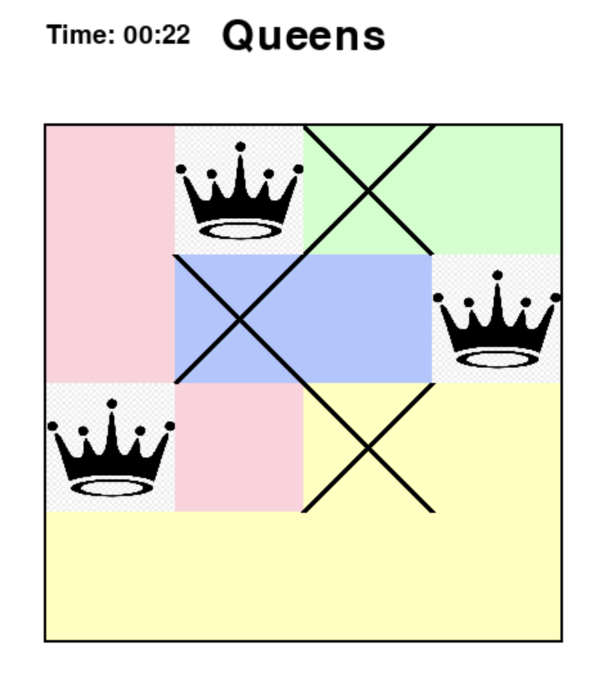

# queens
Recreate Queens game as seen on LinkedIn: https://www.linkedin.com/games/queens/

## Dev Setup
### Environment setup
`poetry init`

## Generate game
1. Generate n-queens: `python src/generator/generate_n_queens.py`
2. [WIP] Generate color zones for n-queens: `python src/generator/generate_color_zones.py`

## Start game
`python src/main.py`

## Game play:
1. Left-click to place or remove queen
2. Right-click to place or remove crosses

